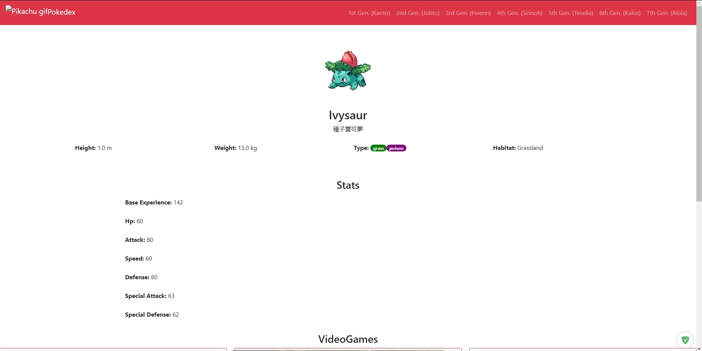
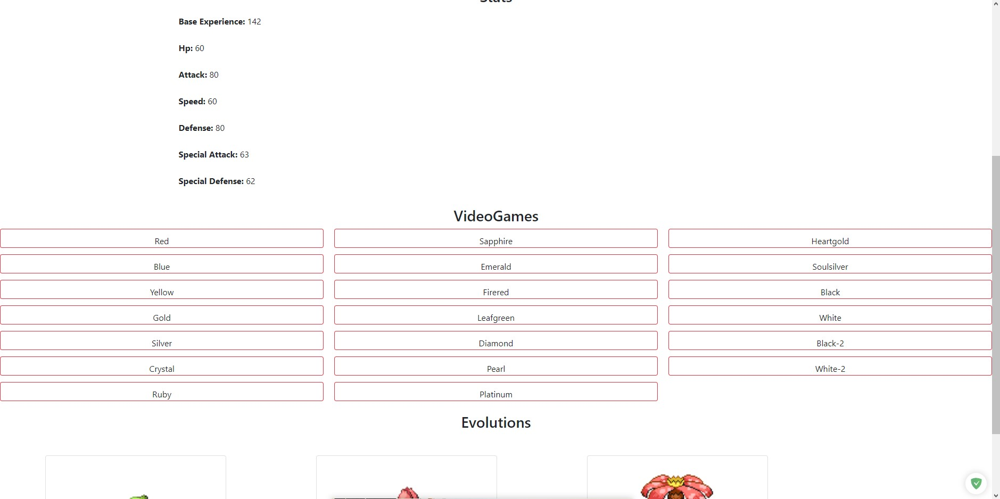

A little Pokedex coded in ReactJs with the help of the pokemon API. 

Simple pokedex from generation 1 to 7

With a general description of the Pokémon, such as statistics, appearances in games, etc.

